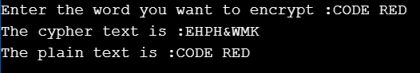

# Binary Tree Encryption

A new data encryption and decryption method is proposed using ASCII values of characters in the
plaintext and Binary Tree Traversal (BTT). First level encryption uses ASCII values of the plaintext characters
to achieve substitution. Then, the binary tree traversal is used as the second level of encryption for achieving
permutation.

# Method 
The proposed method uses two levels of encryption. The first level encryption is based on substitution using ASCII values and the second level of encryption is based on transposition using binary tree traversal. ASCII values of alphabets in the plaintext are in
the range 65-90 as A-65,B-66 and so on. The SPACE between each word in the plain text is also considered as a separate character and converted to the corresponding ASCII value.
Two consecutive characters in the plaintext form a pair. If there are odd numbers of characters in the plaintext, then a SPACE character can be used as filler at the end of the plaintext to form a pair. Position value starts from 1. In each pair, the value on the left is calculated to be the sum of the ASCII value of the left character and the position valueof the right character. Similarly, the value on the right is calculated to be the sum ofthe ASCII value of the right character and the position value of the left character. A complete binary tree is constructed in the second level of encryption. Nodes are constructed from left to right in a complete binary tree. After two
levels of encryption, receiver receives the encrypted text which is the level order traversal of the complete binary tree.
## Output

